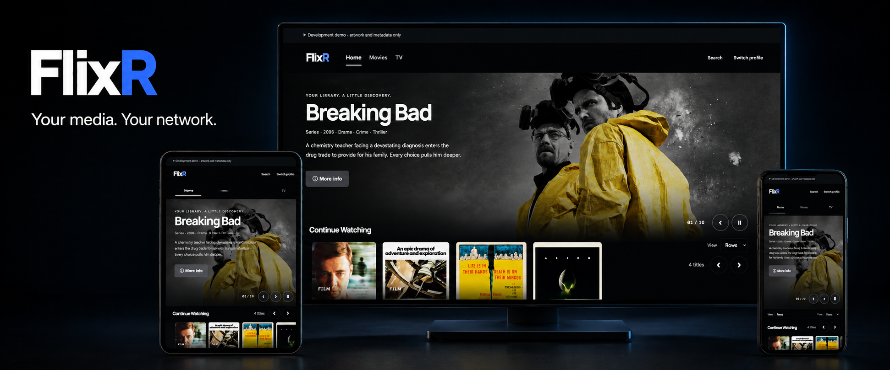

# FlixR

FlixR is a free, open-source media server for your movies and TV shows.
Run it at home, choose a profile, and watch in your browser. Your accounts,
library and playback stay on your server and work without an internet connection.
Internet access is needed to download FlixR and optional metadata or artwork.

FlixR supports project-owned TMDB application access so households do not need a
metadata-provider account. Until the maintainer completes the provider registration
and distribution review described in [the release guide](docs/releases.md#tmdb-application-access),
official and source builds report automatic access as unavailable and can use an
optional personal override. Existing credential-optional releases continue normally.

**Early development (0.x).** Browser playback and per-profile audio selection are
available; native TV/mobile apps, Cast, AirPlay and subtitle selection are still
being built.

## Get started in five minutes

You need Docker with Compose 2.24 or newer, and a folder of movies or TV shows.
The first download and library scan may take longer.

### 1. Save the Compose file

Save [compose.release.yml](compose.release.yml) as **`compose.yaml`** in a new folder.
It includes FlixR, FFmpeg, persistent storage and a read-only media mount.

Create a **`.env`** file beside it:

```dotenv
FLIXR_MEDIA_DIR=/absolute/path/to/your/media
FLIXR_BIND_ADDR=0.0.0.0
```

Replace the media path with an existing folder that the container can read.
This enables HTTP access on your trusted home network. For HTTPS or access only
from this computer, see [network setup](docs/docker.md#https-on-the-lan).

### 2. Start FlixR

Open a terminal in that folder and run:

```sh
docker compose up -d --wait
docker compose logs flixr
```

The image currently requires GHCR access. If the pull is denied, use the
[source-build setup](docs/docker.md#build-locally).

### 3. Open the setup screen

Visit **http://localhost:8787**, or **http://YOUR-SERVER-IP:8787** from another device.
Copy the one-time setup token from the logs and create your owner account. Choose
**Start fresh**; existing-server import is reserved in the wizard for a later
release. Setup saves each completed step, so closing the browser or restarting
the container resumes without recreating the owner, libraries, or profile.

Before saving libraries, use **Recheck folders and tools**. It verifies the
container's data and playback-cache volumes, the media folders you entered, and
the bundled FFmpeg tools. Errors show the exact container path and the Compose
mount or permission to correct. These paths appear only after owner sign-in.

Use paths inside the container: if your media folder contains `films/` and `tv/`,
enter **`/media/films`** and **`/media/tv`** in setup.

Your settings and history are saved in Docker volumes. Your media stays read-only.
Use `docker compose down` to stop; **do not add `-v`** unless you want to delete
FlixR's saved data.

## More information

- [Docker configuration, volumes, updates and backups](docs/docker.md)
- [Build from source, run the demo and contribute](docs/development.md)
- [Configure per-profile library, rating and tag access](docs/profile-access.md)
- [Contributing](CONTRIBUTING.md), [support](SUPPORT.md), and [security reporting](SECURITY.md)
- [Release process and versioning](docs/releases.md)
- [Roadmap](https://github.com/mopeyjellyfish/flixr/issues/104)
- [MIT license](LICENSE) and [third-party notices](frontend/THIRD_PARTY_LICENSES.md)

The banner shows the demo, which contains artwork and metadata for 50 movies and
50 TV shows, without video files. See the [demo guide](docs/development.md#development-demo).
